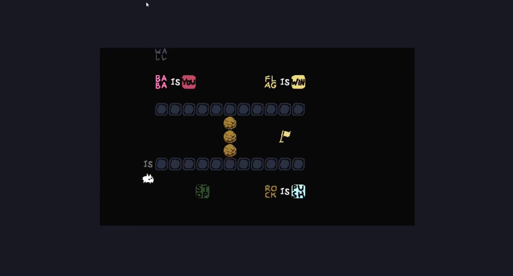

# Baba Is You (Tribute) 

Baba Is You is a very popular puzle game that has been awarded prizes, we have created a simple 
tribute to the game with an OpenGL C++ implementation, it tries to recreate simple functionalities 
of the game. 

# Installation 
The game can be executed in Windows 10 using the executable in the Release folder, although it can be compiled 
and executed in any enviroment with an OpenGL installation. 

# Contributors 
Josep Maria Olivé 
